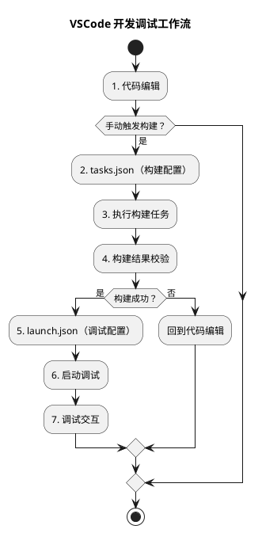
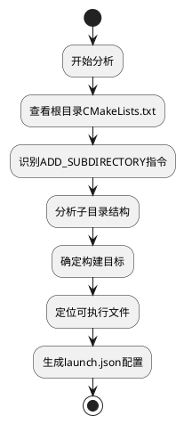

# `tasks.json`



## 1. 基本定位

替代手动在终端输入长命令（如 `cmake -B build -G Ninja && ninja -C build`）。

`tasks.json`是VSCode的任务配置文件，用于定义各种自动化任务。配合 VS Code 的 “任务运行” 功能（快捷键 `Ctrl+Shift+B`），一键触发构建、测试等操作：
- **构建任务**：编译代码、生成可执行文件
- **测试任务**：运行单元测试、集成测试
- **清理任务**：删除构建产物
- **自定义任务**：执行脚本、处理文件等

可作为 `launch.json`（调试配置）的 “前置任务”（`preLaunchTask`），实现 “先构建，再调试” 的自动化流程。

创建 `tasks.json` 的步骤：
1. 打开 VS Code，进入项目根目录。
2. 点击菜单栏 **Terminal → Run Task**（或按 `Ctrl+Shift+P` 输入 _Tasks: Run Task_）。
3. 首次操作会提示 “没有任务可运行，点击创建 `tasks.json` 文件”，选择后 VS Code 会自动生成模板（模板类型可选择，比如 “Others” 表示自定义命令）。

## 2. `tasks.json`与`launch.json`的协同机制

如果要实现 “调试前自动构建”，需在 `launch.json` 中配置 `preLaunchTask`，指定要先执行的 `tasks.json` 任务的 `label`。

| 配置文件 | 主要职责 | 调用关系 |
|---------|---------|---------|
| `tasks.json` | 构建、测试、清理等自动化任务 | 被`launch.json`通过`preLaunchTask`调用 |
| `launch.json` | 调试配置、程序启动参数 | 调用`tasks.json`确保调试最新代码 |

```json
// launch.json中的配置示例
{
    "name": "osgviewer Debug",
    "type": "cppdbg",
    "request": "launch",
    "program": "${workspaceFolder}/osgviewer", // 要调试的可执行文件路径
    "preLaunchTask": "cmake: build",  // 引用tasks.json中的任务
}
```

## 3. tasks.json 编写规范详解

### 3.1 基本文件结构

```json
{
  "version": "2.0.0",         // 任务配置版本，固定为 "2.0.0"
  "tasks": [                  // 任务列表，可定义多个任务
    {
      "label": "CMake: 生成构建文件",  // 任务的“显示名称”，用于 VS Code 界面选择
      "type": "shell",        // 任务类型："shell"（在终端执行命令）或 "process"（直接运行程序）
      "command": "cmake",     // 要执行的命令（如 cmake、ninja、gcc 等）
      "args": [               // 命令的参数列表
        "-B", "build",        // -B 指定构建目录为 build
        "-G", "Ninja"         // -G 指定生成器为 Ninja
      ],
      "options": {            // 执行命令时的“环境选项”（如工作目录、环境变量）
        "cwd": "${workspaceFolder}"  // 工作目录：当前 VS Code 打开的项目根目录
      },
      "problemMatcher": [],   // 问题匹配器：用于识别编译错误，自动在“问题面板”显示（C/C++ 可配 "$gcc" 等）
      "group": {              // 任务分组：定义任务属于“构建”“测试”等类别
        "kind": "build",      // 类别为“构建”，这样按 Ctrl+Shift+B 会自动关联
        "isDefault": true     // 设置为“默认构建任务”，Ctrl+Shift+B 直接触发它
      }
    },
    {
      "label": "Ninja: 编译项目",
      "type": "shell",
      "command": "ninja",
      "args": [
        "-C", "build"         // -C 指定构建目录为 build
      ],
      "options": {
        "cwd": "${workspaceFolder}"
      },
      "problemMatcher": ["$gcc"],  // 匹配 GCC 类编译器的错误（C/C++ 项目常用）
      "group": {
        "kind": "build",
        "isDefault": false    // 不设为默认，需手动选择或作为前置任务
      }
    }
  ]
}
```

### 3.2 字段说明

#### 核心必要字段
- **`version`**: `"2.0.0"` - 固定版本号
- **`tasks`**: 数组 - 包含所有任务定义
- **`label`**: 字符串 - 任务的唯一标识符，用于`preLaunchTask`引用

#### 任务类型相关字段
- **`type`**: 选择任务执行方式
  - `"shell"`: 在系统shell中执行（推荐，支持环境变量）
  - `"process"`: 直接执行进程（更高效，但环境变量受限）

#### 命令执行配置
```json
"command": "cmake",
"args": ["--build", "${workspaceFolder}", "--config", "Debug"],
"options": {
    "cwd": "${workspaceFolder}"
}
```

#### 任务分组配置
```json
"group": {
    "kind": "build",      // build|test|none
    "isDefault": true     // 是否作为默认任务
}
```

#### 任务依赖链配置
```json
"dependsOn": ["clean", "configure"],  // 依赖多个任务
"dependsOrder": "sequence"            // 顺序执行依赖
```

## 4. 实际应用场景配置示例

### 4.1 基础构建任务
```json
{
    "label": "cmake: build",
    "type": "shell",
    "command": "cmake",
    "args": [
        "--build", 
        "${workspaceFolder}",
        "--config", 
        "Debug",
        "--parallel"
    ],
    "group": {
        "kind": "build",
        "isDefault": true
    },
    "presentation": {
        "echo": true,
        "reveal": "always",
        "panel": "shared"
    },
    "problemMatcher": ["$gcc"]
}
```

### 4.2 Ninja构建系统专用配置
```json
{
    "label": "ninja: build",
    "type": "shell",
    "command": "ninja",
    "args": ["-C", "${workspaceFolder}"],
    "group": "build",
    "presentation": {
        "reveal": "silent"
    }
}
```

### 4.3 多阶段构建任务链
```json
{
    "label": "configure",
    "type": "shell",
    "command": "cmake",
    "args": ["-B", "${workspaceFolder}", "-S", "${workspaceFolder}"],
    "group": "build"
},
{
    "label": "build-all",
    "type": "shell", 
    "command": "cmake",
    "args": ["--build", "${workspaceFolder}", "--target", "all"],
    "group": "build",
    "dependsOn": "configure"
}
```

### 4.4 测试任务配置
```json
{
    "label": "test",
    "type": "shell",
    "command": "ctest",
    "args": ["-C", "Debug", "--output-on-failure"],
    "group": {
        "kind": "test",
        "isDefault": true
    },
    "presentation": {
        "reveal": "always"
    }
}
```

## 5. 跨平台兼容性处理
### 5.1 条件任务配置
```json
{
    "label": "build",
    "type": "shell",
    "command": "${command:cmake.build}",
    "windows": {
        "command": "cmake",
        "args": ["--build", ".", "--config", "Debug"]
    },
    "linux": {
        "command": "make",
        "args": ["-j4"]
    },
    "osx": {
        "command": "make", 
        "args": ["-j", "$(sysctl -n hw.ncpu)"]
    }
}
```

### 5.2 环境变量处理
```json
"options": {
    "env": {
        "PATH": "/usr/local/bin:${env:PATH}",
        "OSG_FILE_PATH": "${workspaceFolder}/data"
    }
}
```

---
# `launch.json` 



## 1. 项目结构分析步骤

基于对OpenSceneGraph 3.7.0项目的分析：

```
OpenSceneGraph/
├── CMakeLists.txt          # 根配置，定义项目版本和全局设置
├── applications/           # 核心应用程序目录
│   ├── CMakeLists.txt     # 应用程序构建配置
│   ├── osgviewer/         # 查看器应用程序
│   ├── osgarchive/        # 归档工具
│   └── ...
└── examples/              # 示例程序目录
    ├── CMakeLists.txt     # 184个示例程序配置
    ├── osganimate/        # 动画示例
    ├── osgparticle/       # 粒子系统示例
    └── ...
```

**第一步：查看根目录CMakeLists.txt**
1. 项目的根目录结构 
2. CMake配置情况 
3. 是否有可执行文件或应用程序 
4. 项目的构建配置

**第二步：分析子目录结构**
1. 根目录的CMakeLists.txt文件，了解项目的基本配置 
2. applications目录的内容，看看有哪些可执行程序 
3. examples目录的内容，了解示例程序
4. 查看具体子目录的CMakeLists.txt，了解具体构建配置

**第三步：确定构建目标**
1. 从applications的CMakeLists.txt可以看到，通过`ADD_SUBDIRECTORY`指令识别所有子项目
2. 现在需要查看其中一个应用程序的目录结构，比如osgviewer，来了解可执行文件的名称和结构
3. osgviewer目录可以看到有osgviewer.cpp文件，这应该就是主要的可执行文件源码
4. 查看osgviewer的CMakeLists.txt文件可以看到，它使用了SETUP_APPLICATION(osgviewer)来设置应用程序，这意味着可执行文件的名字应该是osgviewer
5. 确定最终生成的可执行文件名称和路径

**项目结构**

更抽象的结构是这样：

```
project_root/
├── CMakeLists.txt              # 根配置，定义项目基本信息
├── src/
│   ├── CMakeLists.txt          # 源代码配置
│   ├── main_app/
│   │   ├── CMakeLists.txt      # 主应用配置
│   │   └── main.cpp
│   └── lib/
│       ├── CMakeLists.txt      # 库配置
│       └── utility.cpp
├── tests/
│   ├── CMakeLists.txt          # 测试配置
│   └── test_main.cpp
├── examples/
│   ├── CMakeLists.txt          # 示例配置
│   └── demo.cpp
└── build/                      # 构建输出目录
    ├── bin/                    # 可执行文件
    ├── lib/                    # 库文件
    └── CMakeCache.txt

```

## 2. launch.json文件结构设计

### 2.1 基本框架

```json
{
    "version": "0.2.0",
    "configurations": [
        // 调试配置项数组
    ]
}
```

1. **通用配置** - 基础调试设置
2. **应用程序配置** - 核心工具调试
3. **示例程序配置** - 功能演示调试
4. **插件配置** - 扩展功能调试

### 2.2 必要字段（必须包含）

| 字段名       | 类型     | 说明                   | 示例值                                        |
| --------- | ------ | -------------------- | ------------------------------------------ |
| `name`    | string | 调试配置的名称              | `"osgviewer Debug"`                        |
| `type`    | string | 调试器类型，C++项目通常为cppdbg | `"cppdbg"`                                 |
| `request` | string | 调试请求类型，launch或attach | `"launch"`                                 |
| `program` | string | 可执行文件路径              | `"${workspaceFolder}/build/bin/osgviewer"` |
```json
{
    "name": "osgviewer Debug",
    "type": "cppdbg",
    "request": "launch",
    "program": "${workspaceFolder}/build/bin/osgviewer",
}
```

### 2.3 推荐字段（增强调试体验）

| 字段名             | 类型     | 说明       | 选择依据                                                      |
| --------------- | ------ | -------- | --------------------------------------------------------- |
| `preLaunchTask` | string | 调试前执行的任务 | 关联CMake构建任务，确保调试最新版本                                      |
| `args`          | array  | 命令行参数    | 根据程序功能设置，如模型文件路径等<br>`["--verbose", "-c", "config.json"]` |
| `cwd`           | string | 工作目录     | 通常设置为可执行文件所在目录                                            |
| `environment`   | array  | 环境变量设置   | `[{"name": "PATH", "value": "/usr/local/bin"}]`           |
```json
{
    "args": [],
    "cwd": "${workspaceFolder}",
    "MIMode": "lldb",
    "preLaunchTask": "cmake: build",
    "environment": []
}
```

| 字段名      | 类型     | 说明    | 选择依据                                               |
| -------- | ------ | ----- | -------------------------------------------------- |
| `MIMode` | string | 调试器模式 | 根据操作系统选择：macOS→lldb，Linux→gdb，Windows→gdb或cppvsdbg |
**macOS系统**
- 默认选择: "lldb"
- 原因: macOS系统内置LLDB，与Xcode工具链集成良好
- 配置示例:
```json
"MIMode": "lldb",
"setupCommands": [
    {
        "description": "启用整齐打印",
        "text": "type summary add --summary-string \"${var%s}\" -x \".*\" --category default",
        "ignoreFailures": true
    }
]
```

**Linux系统**
- 推荐选择: "gdb"
- 原因: Linux标准调试器，功能完善
- 配置示例:
```json
"MIMode": "gdb",
"setupCommands": [
    {
        "description": "启用整齐打印",
        "text": "-enable-pretty-printing",
        "ignoreFailures": true
    }
]
```

**Windows系统**
- 选择1: "gdb"（MinGW环境）
- 选择2: "cppvsdbg"（Visual Studio环境）
- 配置差异:
```json
// MinGW环境
"MIMode": "gdb",
"miDebuggerPath": "C:/mingw64/bin/gdb.exe"

// VS环境  
"MIMode": "cppvsdbg"
```

### 2.4 可选字段（特定需求）

| 字段名               | 类型      | 说明        | 使用场景        |
| ----------------- | ------- | --------- | ----------- |
| `stopAtEntry`     | boolean | 是否在程序入口暂停 | 需要单步调试时     |
| `externalConsole` | boolean | 使用外部控制台   | 需要独立终端输出时   |
| `setupCommands`   | array   | 调试器初始化命令  | 配置美化打印等高级功能 |

```json
"setupCommands": [
    {
        "description": "Enable pretty-printing for gdb",
        "text": "-enable-pretty-printing",
        "ignoreFailures": true
    }
]
```

### 2.5 路径变量使用

| 变量 | 含义 | 使用场景 |
|------|------|----------|
| `${workspaceFolder}` | 工作区根目录 | 构建路径、资源文件路径 |
| `${file}` | 当前打开的文件 | 调试特定文件相关的程序 |
| `${fileDirname}` | 当前文件所在目录 | 设置工作目录 |

## 3. 与CMake项目的集成机制

### 3.1 构建任务关联

```json
"preLaunchTask": "cmake: build"
```

**工作原理**：
1. 调试前自动执行CMake构建任务
2. 确保调试的是最新编译版本
3. 自动处理依赖关系构建

### 3.2 路径映射策略

**构建目录约定**：
- CMake通常生成`build/`目录
- 可执行文件位于`build/bin/`
- 库文件位于`build/lib/`

**路径配置示例**：
```json
"program": "${workspaceFolder}/build/bin/osgviewer",
"cwd": "${workspaceFolder}/build/bin"
```

---
